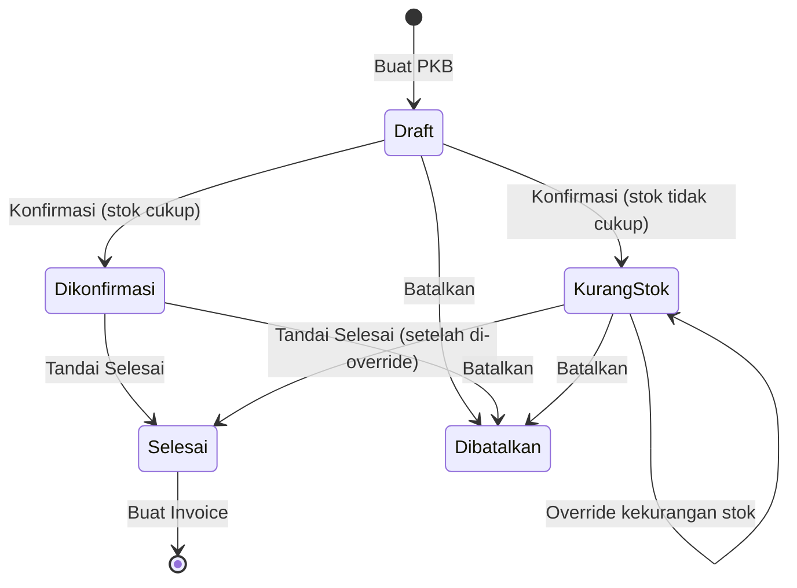
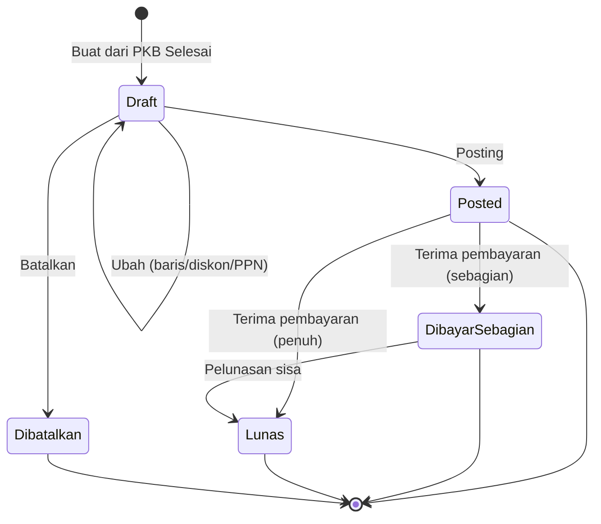
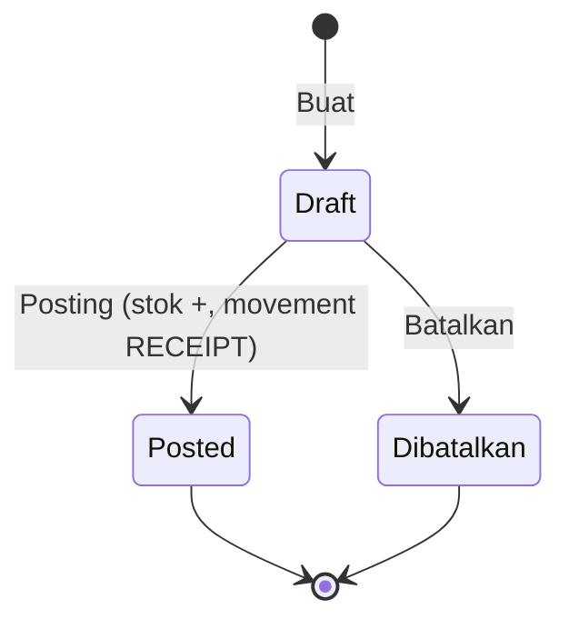
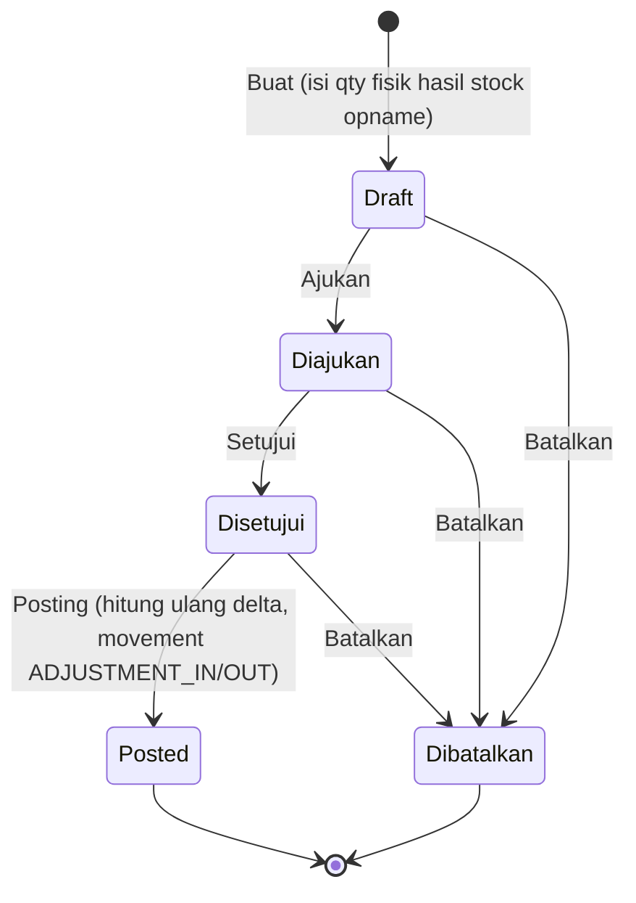
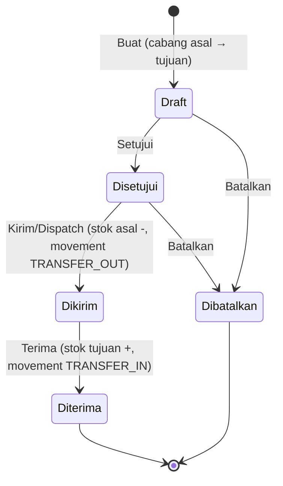
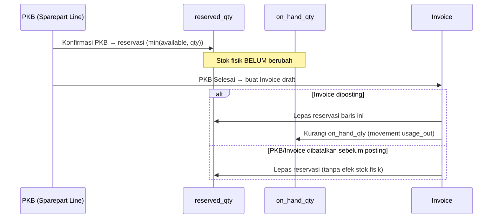

# Panduan Pengguna — Sistem Manajemen Bengkel

**Terakhir diperbarui:** 2026-08-07

Dokumen ini adalah panduan operasional untuk staf bengkel (admin, kasir, mekanik, kepala cabang) menggunakan aplikasi Sistem Manajemen Bengkel. Fokus utama panduan ini adalah **alur kerja end-to-end** dan **pergerakan stok sparepart** — bagian yang paling sering membingungkan karena melibatkan beberapa modul (PKB, Invoice, Penerimaan Barang, Stock Adjustment, Transfer Stock) yang saling memengaruhi angka stok yang sama.

---

## Daftar Isi

1. [Konsep Dasar](#1-konsep-dasar)
2. [Login & Hak Akses](#2-login--hak-akses)
3. [Master Data (Setup Awal)](#3-master-data-setup-awal)
4. [Konsep Stok: On-Hand, Reserved, Available](#4-konsep-stok-on-hand-reserved-available)
5. [Alur PKB (Perintah Kerja Bengkel)](#5-alur-pkb-perintah-kerja-bengkel)
6. [Alur Invoice](#6-alur-invoice)
7. [Alur Penerimaan Pembayaran](#7-alur-penerimaan-pembayaran)
8. [Cetak & Kirim Dokumen](#8-cetak--kirim-dokumen)
9. [Pergerakan Stok — Detail Lengkap](#9-pergerakan-stok--detail-lengkap)
10. [Kartu Stok (Riwayat Pergerakan)](#10-kartu-stok-riwayat-pergerakan)
11. [Laporan](#11-laporan)
12. [Troubleshooting Umum](#12-troubleshooting-umum)

---

## 1. Konsep Dasar

Sistem ini mengelola operasional bengkel multi-cabang: mulai dari **PKB** (Perintah Kerja Bengkel — pekerjaan servis kendaraan customer), **Invoice** (tagihan dari PKB yang selesai), **Pembayaran**, hingga **persediaan sparepart** per cabang (penerimaan barang, penyesuaian stok, transfer antar-cabang).

Prinsip yang berlaku di semua modul:

- **Semua data operasional (PKB, Invoice, Pembayaran, Stok) terikat ke satu Cabang** (`branch_id`). Sparepart di Cabang A dan Cabang B adalah baris stok yang terpisah sepenuhnya, meskipun sparepart-nya sama (kode/nama sama).
- **Hak akses (permission) bersifat per-cabang.** Seorang user bisa punya akses "Lihat PKB" di Cabang Jakarta tapi tidak di Cabang Bandung — tergantung penugasan cabang & permission yang diberikan admin.
- **Setiap dokumen transaksi (PKB, Invoice, Penerimaan Barang, Stock Adjustment, Transfer Stock) punya alur status (lifecycle)** yang harus dilalui berurutan — tidak bisa loncat status, dan begitu status tertentu tercapai (misalnya "Posted"), sebagian besar field dokumen tidak bisa diubah lagi.

---

## 2. Login & Hak Akses

- Login menggunakan **username** dan **password** yang dibuatkan oleh admin.
- Setelah login, menu yang tampil di sidebar **hanya menu yang usernya punya izin** untuk salah satu cabang yang ditugaskan padanya. Jika tidak ada satupun cabang dengan izin untuk suatu modul, halaman modul tersebut akan menampilkan pesan "Anda belum memiliki akses..." alih-alih daftar kosong.
- Admin mengatur ini lewat menu **Users** (Administrasi):
  - **User Branches** — cabang mana saja yang bisa diakses user tersebut.
  - **User Permissions** — kombinasi (cabang × permission) yang diberikan ke user, mis. `pkb.create` di Cabang Jakarta, `invoice.view` di Cabang Jakarta & Bandung.
- Modul non-operasional (Master Data seperti Cabang, Customer, Kendaraan, Mekanik, Jasa Service, User) **tidak terikat cabang** — izinnya berlaku global begitu diberikan.

---

## 3. Master Data (Setup Awal)

Sebelum bisa membuat PKB, pastikan data berikut sudah diisi (biasanya sekali di awal, lalu ditambah sesuai kebutuhan):

| Master Data | Keterangan |
|---|---|
| **Cabang** | Nama, alamat, telepon cabang. Dipakai di header cetak Invoice/PKB. |
| **Customer** | Data pelanggan (perorangan/perusahaan), termasuk email (dipakai untuk fitur Kirim Invoice via Email). |
| **Kendaraan** | Kendaraan milik customer (no. polisi, merk/tipe). |
| **Referensi Kendaraan** | Kategori → Merk → Tipe kendaraan (hierarki referensi, dipakai saat input Kendaraan baru). |
| **Mekanik** | Data mekanik, ditugaskan ke satu atau lebih cabang. |
| **Jasa Service** | Katalog jasa standar (nama + harga default) — dipakai sebagai pilihan cepat saat mengisi baris jasa di PKB maupun Invoice, tapi deskripsi & harga tetap bisa disesuaikan manual per transaksi. |
| **Master Sparepart** | Data sparepart per cabang (kode, nama, harga jual, stok minimum). Setiap sparepart harus dikonfigurasi ulang per cabang sebelum bisa dipakai/diterima di cabang tersebut. |

---

## 4. Konsep Stok: On-Hand, Reserved, Available

Ini konsep paling penting untuk dipahami sebelum masuk ke alur PKB/Invoice. Setiap baris **Sparepart × Cabang** punya dua angka stok:

- **`on_hand_qty`** — stok fisik yang benar-benar ada di gudang cabang tersebut.
- **`reserved_qty`** — bagian dari `on_hand_qty` yang sudah "dikunci" untuk PKB yang sedang berjalan, tapi **belum benar-benar keluar dari gudang**.
- **`available_qty`** (dihitung, tidak disimpan) = `on_hand_qty` − `reserved_qty`. Ini yang dipakai sistem untuk menentukan apakah PKB baru bisa mendapat reservasi penuh atau kurang stok (shortage).

> **Aturan besi:** `reserved_qty` tidak pernah boleh melebihi `on_hand_qty` (dijaga oleh database, bukan cuma validasi aplikasi).

Selain angka stok, ada **dua jenis catatan riwayat** yang terpisah:

1. **Reservasi (`inventory_reservations`)** — catatan "soft hold", dibuat saat PKB dikonfirmasi. Tidak pernah mengurangi `on_hand_qty`, hanya menambah `reserved_qty`. Reservasi bisa **dilepas** (status `released`) tanpa efek stok fisik apa pun.
2. **Pergerakan Stok / Kartu Stok (`inventory_movements`)** — ledger permanen, dibuat setiap kali `on_hand_qty` **benar-benar berubah** (masuk atau keluar gudang sungguhan). Setiap baris punya `qty_in`/`qty_out` dan `balance_after` (saldo setelah pergerakan itu) — inilah yang ditampilkan di halaman **Kartu Stok**.

Jadi: **reservasi ≠ pergerakan stok.** PKB yang dikonfirmasi hanya membuat reservasi (stok belum keluar gudang secara sungguhan) — stok baru benar-benar berkurang saat **Invoice-nya di-posting** (lihat §9).

---

## 5. Alur PKB (Perintah Kerja Bengkel)

1. **Buat PKB (Draft)** — isi data customer, kendaraan, mekanik, tanggal, kilometer, lalu tambahkan baris **Jasa** (bebas ketik atau pilih dari Master Jasa) dan baris **Sparepart** (wajib pilih dari Master Sparepart cabang tersebut — tidak bisa manual/bebas seperti jasa). PKB masih **Draft**, belum memengaruhi stok sama sekali.
2. **Konfirmasi** — titik pertama PKB menyentuh stok. Untuk setiap baris sparepart, sistem menghitung `available_qty` saat itu juga, lalu **mereservasi** sebanyak mungkin (`min(available_qty, qty_diminta)`):
   - Jika semua baris dapat reservasi penuh → status **Dikonfirmasi (Open)**.
   - Jika ada baris yang tidak dapat reservasi penuh → status **Kurang Stok (Shortage)**, dan sisa reservasi yang berhasil tetap tercatat (reservasi parsial).
3. **Override Kekurangan Stok** *(khusus status Kurang Stok)* — supervisor menyetujui PKB tetap dilanjutkan meski sparepart belum cukup (mis. menunggu kiriman dari cabang lain / rekanan). Ini **tidak menambah stok maupun reservasi** — hanya mencatat alasan & siapa yang menyetujui, agar PKB bisa ditandai selesai.
4. **Tandai Selesai** — hanya bisa dari status Dikonfirmasi, atau Kurang Stok yang **sudah** di-override. Tidak ada efek stok tambahan di langkah ini.
5. **Batalkan** — bisa dari Draft, Dikonfirmasi, atau Kurang Stok (tidak bisa lagi setelah Selesai). Jika PKB sudah sempat dikonfirmasi, semua reservasi aktif untuk PKB ini **dilepas** (`reserved_qty` dikembalikan) — stok fisik tidak terpengaruh karena memang belum pernah benar-benar keluar.
6. **Buat Invoice** — muncul otomatis di halaman detail PKB begitu status **Selesai** dan belum ada invoice untuk PKB itu. Baris jasa & sparepart di PKB disalin apa adanya ke Invoice draft.
7. **Cetak PKB** — tersedia di status apa pun (Draft s.d. Dibatalkan), tidak ada pembatasan status, karena dokumen ini berguna sebagai lembar kerja mekanik kapan saja.

---

## 6. Alur Invoice

1. **Draft** — dibuat otomatis dari PKB Selesai (lihat §5 langkah 6). Bisa diubah bebas: tambah/hapus baris jasa & sparepart, ubah qty/harga, isi diskon (%), PPN (%), tanggal jatuh tempo, catatan.
   - Baris yang **berasal dari PKB** (jasa maupun sparepart) tampil **read-only** di form Ubah — hanya qty & harga yang bisa disesuaikan, deskripsinya terkunci karena sudah tersimpan sejak PKB.
   - Baris **baru** yang ditambahkan langsung di Invoice (tidak berasal dari PKB) untuk jasa bisa pilih dari Master Jasa; untuk sparepart wajib pilih dari Master Sparepart cabang tersebut.
   - Menghapus baris sparepart yang berasal dari PKB (baik lewat Ubah, maupun via Batalkan Invoice) akan **melepas reservasi** baris tersebut — sama seperti PKB dibatalkan.
2. **Posting** — **titik paling penting untuk stok** (detail lengkap di §9). Saat invoice di-posting:
   - Untuk setiap baris sparepart: reservasi PKB-nya (jika ada) dilepas, lalu `on_hand_qty` **benar-benar dikurangi** sebesar qty di baris invoice, dan dicatat sebagai pergerakan stok `usage_out`.
   - Jika stok ternyata tidak cukup di detik-detik terakhir (mis. dipakai transaksi lain), posting **ditolak seluruhnya** (all-or-nothing) dengan pesan sparepart mana yang kurang — tidak ada yang terpotong sebagian.
   - Status berubah ke **Posted**. Setelah ini invoice **tidak bisa diubah lagi**.
3. **Batalkan** — hanya bisa selagi masih **Draft**. Melepas semua reservasi sparepart yang tersisa. Invoice yang sudah Posted **tidak bisa dibatalkan** lewat aplikasi (di luar cakupan sistem ini — perlu proses manual/akuntansi terpisah bila terjadi).
4. **Dibayar Sebagian / Lunas** — status ini otomatis dihitung ulang oleh sistem setiap kali ada pembayaran masuk atau di-void (lihat §7), berdasarkan `paid_amount` vs `grand_total`. Tidak ada aksi manual untuk mengubah status ini.

---

## 7. Alur Penerimaan Pembayaran

1. **Catat Pembayaran** — pilih customer, lalu alokasikan nominal pembayaran ke satu atau beberapa invoice **Posted/Dibayar Sebagian** milik customer tersebut (tidak melebihi sisa piutang invoice yang dipilih). Setiap pembayaran otomatis berstatus **Posted**.
2. Setiap alokasi menambah `paid_amount` invoice terkait, lalu status invoice dihitung ulang (Posted → Dibayar Sebagian atau Lunas).
3. **Void Pembayaran** — membalikkan seluruh alokasi pembayaran tersebut (`paid_amount` invoice dikurangi kembali, status invoice dihitung ulang turun jika perlu). Pembayaran yang sudah **void tidak muncul lagi** di riwayat pembayaran pada cetakan Invoice maupun lampiran email — hanya pembayaran **Posted** yang ditampilkan di sana.
4. Pembayaran **tidak memengaruhi stok sparepart sama sekali** — modul ini murni transaksi keuangan.

---

## 8. Cetak & Kirim Dokumen

| Dokumen | Kapan tersedia | Cara |
|---|---|---|
| **Cetak PKB** | Status apa pun | Tombol "Cetak PKB" di halaman detail PKB → buka tab baru berisi PDF (lembar kerja: data customer/kendaraan, baris jasa & sparepart, kolom tanda tangan mekanik/customer). |
| **Cetak Invoice** | Posted / Dibayar Sebagian / Lunas saja (Draft & Dibatalkan tidak bisa) | Tombol "Cetak Invoice" → PDF nota resmi (header cabang, data customer/kendaraan, baris invoice, ringkasan Subtotal/Diskon/PPN/Grand Total, **riwayat pembayaran yang Posted saja**, kolom tanda tangan). |
| **Kirim Invoice via Email** | Sama seperti Cetak Invoice | Tombol "Kirim Email" → PDF invoice yang identik dengan versi cetak dilampirkan otomatis dan dikirim ke email customer, diproses lewat antrean (asynchronous) — muncul pesan konfirmasi "sedang dikirim", bukan langsung terkirim saat itu juga. Ditolak dengan pesan error jika customer belum punya alamat email. |

Kedua permission `pkb.print`, `invoice.print`, dan `invoice.email` diatur terpisah dari `pkb.view`/`invoice.view` — seorang user bisa saja boleh melihat PKB/Invoice tapi tidak boleh mencetak/mengirimnya, tergantung penugasan admin.

---

## 9. Pergerakan Stok — Detail Lengkap

Ini bagian inti panduan: **enam jenis pergerakan stok** yang bisa tercatat di sistem, siapa yang memicunya, dan efeknya ke `on_hand_qty`.

| Kode Movement | Label di Kartu Stok | Dipicu oleh | Efek `on_hand_qty` |
|---|---|---|---|
| `receipt` | Penerimaan | Posting **Penerimaan Barang** | ⬆️ bertambah |
| `usage_out` | *(tampil sebagai kode mentah `usage_out`)* | Posting **Invoice** (pemakaian sparepart untuk servis) | ⬇️ berkurang |
| `adjustment_in` | Penyesuaian Masuk | Posting **Stock Adjustment**, hasil hitung fisik **lebih tinggi** dari sistem | ⬆️ bertambah |
| `adjustment_out` | Penyesuaian Keluar | Posting **Stock Adjustment**, hasil hitung fisik **lebih rendah** dari sistem | ⬇️ berkurang |
| `transfer_out` | Transfer Keluar | **Kirim (dispatch)** Transfer Stock — di cabang **asal** | ⬇️ berkurang (cabang asal) |
| `transfer_in` | Transfer Masuk | **Terima** Transfer Stock — di cabang **tujuan** | ⬆️ bertambah (cabang tujuan) |

Setiap baris pergerakan tercatat lengkap dengan `qty_in`/`qty_out`, **saldo setelahnya** (`balance_after`), dan tautan ke dokumen sumbernya — inilah yang membentuk **Kartu Stok** per sparepart per cabang (§10).

> Reservasi PKB (§4, §5) **tidak pernah** menghasilkan baris di tabel ini — reservasi murni memengaruhi `reserved_qty`, bukan `on_hand_qty`, jadi tidak pernah muncul di Kartu Stok sampai betul-betul terjadi pergerakan fisik (lewat posting Invoice, atau dilepas begitu saja tanpa jejak jika PKB/Invoice dibatalkan sebelum posting).

### 9.1 Penerimaan Barang (Goods Receipt)

- **Draft** — input daftar sparepart yang diterima (per baris: sparepart, qty, harga beli). Belum ada efek stok.
- **Posting** — untuk setiap baris, `on_hand_qty` **langsung bertambah** sejumlah qty, dan dicatat movement `receipt`. Tidak ada validasi terhadap reservasi (menerima barang baru tidak pernah bisa melanggar batas reservasi, karena reservasi selalu ≤ on-hand yang lama, dan on-hand yang baru pasti lebih besar).
- **Batalkan** — hanya bisa selagi **Draft**. Setelah Posted, tidak bisa dibatalkan lewat aplikasi (barang sudah tercatat masuk gudang).

### 9.2 Stock Adjustment (Penyesuaian Stok)

- **Draft** — input hasil hitung fisik (`physical_qty`) per sparepart, lengkap dengan alasan. Sistem langsung menghitung selisih (`adjustment_qty` = fisik − sistem) sebagai catatan, tapi **belum diterapkan** ke stok.
- **Ajukan → Setujui** — alur persetujuan dua tahap sebelum boleh diposting (siapa yang mengajukan biasanya bukan siapa yang menyetujui/posting — dipisah lewat permission `stock_adjustment.create` vs `.approve` vs `.post`).
- **Posting** — **delta dihitung ULANG saat ini juga** terhadap `on_hand_qty` **terkini** (bukan memakai angka delta lama yang dicatat saat draft) — supaya penyesuaian tetap akurat meski ada pergerakan stok lain di antara waktu draft dan posting. Ditolak seluruhnya (semua baris, all-or-nothing) jika ada baris yang hasil hitung fisiknya **lebih kecil dari `reserved_qty` yang sedang aktif** (ada PKB yang masih mereservasi sparepart itu) — sistem akan meminta menyelesaikan/membatalkan PKB terkait dulu. Jika lolos validasi: `on_hand_qty` diset langsung ke `physical_qty`, dan dicatat movement `adjustment_in` (jika lebih besar) atau `adjustment_out` (jika lebih kecil) sebesar selisihnya.
- **Batalkan** — bisa dari Draft, Diajukan, atau Disetujui — **tidak bisa** lagi setelah Posted.

### 9.3 Transfer Stock (Antar Cabang)

- **Draft** — pilih cabang asal & tujuan, daftar sparepart + qty yang mau dipindah. Belum ada efek stok.
- **Setujui** — persetujuan sebelum boleh dikirim.
- **Kirim (Dispatch)** — divalidasi dulu (semua baris, all-or-nothing) agar hasil pengurangan stok cabang asal **tidak menembus `reserved_qty` yang sedang aktif** di cabang asal. Jika lolos: `on_hand_qty` cabang **asal** berkurang, dicatat movement `transfer_out`. Status jadi **Dikirim** — pada tahap ini barang dianggap "di jalan", belum tercatat di stok cabang tujuan.
- **Terima** — di sisi cabang **tujuan**, `on_hand_qty` bertambah sejumlah qty yang sama, dicatat movement `transfer_in`. Status jadi **Diterima** (final).
- **Batalkan** — hanya bisa sebelum dikirim (Draft/Disetujui). Setelah dikirim, transfer tidak bisa dibatalkan lewat aplikasi (barang sudah keluar dari stok cabang asal) — harus diselesaikan sampai diterima.

### 9.4 PKB & Invoice terhadap Stok (Ringkasan Alur Utuh)

Poin kunci yang sering jadi pertanyaan:

- **Stok baru benar-benar berkurang saat Invoice di-posting, bukan saat PKB dikonfirmasi.** Selama PKB baru "Dikonfirmasi"/"Kurang Stok"/"Selesai" tapi invoice-nya belum posting, sparepart itu masih ada secara fisik di gudang — hanya "dikunci" (reserved) supaya tidak diambil transaksi lain.
- Baris sparepart yang **ditambahkan manual di Invoice** (tidak berasal dari PKB) tidak pernah punya reservasi — saat invoice diposting, stoknya langsung dikurangi tanpa proses lepas-reservasi (karena memang tidak pernah direservasi).
- Kalau qty di baris Invoice **diubah lebih besar** dari yang direservasi PKB sebelumnya (mis. ternyata butuh sparepart lebih banyak dari perkiraan awal), sistem tetap memvalidasi kecukupan stok **saat posting**, bukan saat reservasi awal — jadi posting bisa saja gagal kalau stok tambahannya ternyata tidak cukup lagi.

---

## 10. Kartu Stok (Riwayat Pergerakan)

Menu **Kartu Stok** menampilkan riwayat pergerakan `on_hand_qty` untuk **satu sparepart di satu cabang** dalam satu waktu:

- Pilih **Cabang** (dari cabang yang Anda punya akses `sparepart.view`), lalu pilih **Sparepart**.
- Ringkasan atas: **On-Hand**, **Reserved**, **Available** (on-hand − reserved) — kondisi stok saat ini.
- Tabel bawah: daftar pergerakan urut waktu, masing-masing menampilkan jenis pergerakan, qty masuk/keluar, **saldo setelah pergerakan itu** (`balance_after`), dan tautan ke dokumen sumbernya (Penerimaan Barang / Stock Adjustment / Transfer Stock — untuk pergerakan dari posting Invoice, nomor dokumennya belum di-link, tampil sebagai kode referensi mentah).
- Kartu Stok **hanya menampilkan pergerakan fisik** (§9) — reservasi PKB yang aktif tidak tampil di sini, hanya terlihat lewat angka **Reserved** di ringkasan atas.

---

## 11. Laporan

| Laporan | Isi |
|---|---|
| **Laporan PKB** | Daftar PKB per cabang/status/periode, mode Rekap & Detail, export Excel & PDF. |
| **Laporan Invoice** | Daftar invoice per cabang/status/periode, export Excel & PDF. |
| **Laporan Piutang** | Invoice yang masih punya sisa piutang (Posted/Dibayar Sebagian), untuk penagihan. |
| **PKB vs Invoice** | Selisih antara PKB yang sudah Selesai tapi belum diinvoice — untuk mengejar PKB yang "kelewat" belum ditagihkan. |
| **Laporan Sparepart/Stok** | Kondisi stok terkini semua sparepart per cabang, termasuk status Kritis (di bawah stok minimum), Habis, Tersedia, dan total nilai inventaris. |
| **Audit Log** | Jejak perubahan data penting sistem (siapa mengubah apa, kapan) — untuk keperluan audit internal. |

Semua laporan tunduk pada cabang yang Anda punya akses `report.*.view` untuk laporan terkait — laporan hanya menampilkan data dari cabang yang diizinkan.

---

## 12. Troubleshooting Umum

**"Kenapa PKB saya langsung Kurang Stok setelah dikonfirmasi?"**
Artinya `available_qty` (on-hand − reserved) untuk salah satu sparepart di baris PKB lebih kecil dari qty yang diminta — mungkin ada PKB lain yang sedang mereservasi sparepart yang sama, atau stok fisiknya memang belum cukup. Cek Kartu Stok sparepart tersebut untuk lihat kondisi terkini, atau ajukan Penerimaan Barang / Transfer Stock dulu, baru Override Kekurangan Stok kalau memang mau tetap lanjut.

**"Saya sudah Terima Barang (Penerimaan Barang) tapi stok belum nambah."**
Pastikan dokumen Penerimaan Barang-nya sudah di-**Posting**, bukan cuma Draft — draft belum menyentuh stok sama sekali.

**"Posting Invoice ditolak, katanya stok tidak cukup — padahal tadi PKB-nya berhasil dikonfirmasi penuh."**
Kemungkinan ada pergerakan stok lain (Stock Adjustment/Transfer Keluar) yang terjadi setelah PKB dikonfirmasi tapi sebelum invoice-nya diposting, sehingga stok fisik yang tersedia sekarang lebih kecil dari yang direservasi dulu. Cek Kartu Stok untuk lihat kronologinya.

**"Posting Stock Adjustment / Kirim Transfer Stock ditolak, katanya melanggar reservasi."**
Ada PKB yang masih aktif mereservasi sparepart tersebut, dan hasil penyesuaian/transfer akan membuat stok fisik jadi lebih kecil dari jumlah yang sedang direservasi (yang secara aturan tidak diperbolehkan). Selesaikan atau batalkan dulu PKB yang bersangkutan sebelum posting/kirim ulang.

**"Tombol Cetak Invoice / Kirim Email tidak muncul di invoice saya."**
Dua kemungkinan: (1) invoice masih berstatus Draft atau sudah Dibatalkan — dua aksi ini hanya tersedia untuk invoice Posted/Dibayar Sebagian/Lunas; (2) Anda tidak punya permission `invoice.print`/`invoice.email` untuk cabang invoice tersebut — minta admin menambahkannya lewat User Permissions.

**"Kirim Email invoice bilang sukses, tapi customer belum terima email-nya."**
Pengiriman email diproses lewat antrean (queue) di background, bukan langsung saat tombol diklik — proses `queue:work` di server harus berjalan aktif agar antrean benar-benar diproses dan email terkirim ke SMTP.

**"Riwayat pembayaran di PDF invoice tidak menampilkan semua pembayaran yang saya catat."**
Pembayaran yang sudah di-**void** memang sengaja tidak ditampilkan di cetakan/lampiran email invoice — hanya pembayaran berstatus Posted yang muncul di sana. Cek status pembayarannya di halaman detail invoice.
